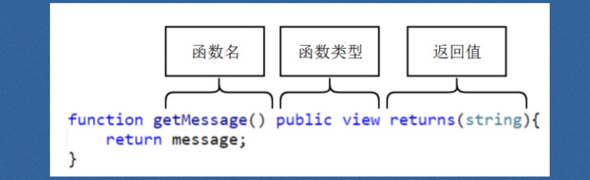

合约总览

```js
//指定编译器版本，版本标识符
pragma solidity ^0.4.17;

//关键字 contract 跟java的class一样 
contract Inbox{
    //string 是数据类型，message是成员变量，在整个智能合约生命周期都可以访问
    //public 是访问修饰符，是storage类型的变量，成员变量和是全局变量
    string public message

    //函数以function开头，构造函数
    function Inbox (string initMessage) public {
        //本地变量
        var tmp = initMessage;
        message = tmp;
    }

    //view是修饰符，表示该函数仅读取成员变量，不做修改
    function getMessage() public view returns(string) {
        return message;
    }
}
```

## 状态变量

定义在合约之内，但是在函数之外的变量，我们叫做`状态变量`，这些变量是会上传到区块链上保存的。

下面这个合约中的==message就是状态变量==。

solidity语言没有main函数，只要合约部署到区块链上，就会永不停歇的执行。

```js
pragma solidity ^0.4.24;

contract Inbox{
    //状态变量
    string public message; 

    function Inbox()payable {
    }

    function setMessage(string newMessage) public{
        //局部变量
        string tmp= "hello";
        message = newMessage;
    }

    function getMessage() public constant returns(string){
        return message;
    }
}
```

## 函数



| 修饰符        | 说明                                         |        |
| ------------- | -------------------------------------------- | ------ |
| public        | 公有,任何人(拥有以太坊账户的)都可以调用      | 牢记   |
| private       | 私有, 只有智能合约内部可以调用               | 牢记   |
| external      | 仅合约外部可以调用，合约内部需使用this调用   | 先忽略 |
| internal      | 仅合约内部和继承的合约可以调用               | 先忽略 |
| view/constant | 函数会读取但是不会修改任何contract的状态变量 | 牢记   |
| pure(纯净的)  | 函数不使用任何智能合约的状态变量             | 牢记   |
| payable       | 调用函数需要付钱，钱付给了智能合约的账户     | 牢记   |
| returns       | 返回值函数声明中使用                         | 牢记   |

函数没有指明可见性，默认是public

### private and public 

```js
pragma solidity ^0.4.24;


contract  Test {
    //状态变量
    //类型不匹配时需要显示转换类型
    //返回值需要使用returns描述


    //public/private 可以修饰状态变量
    //状态变量默认是私有的
    uint256 public ui256 = 100;

    int8 private i10 = -10;


    //private 修饰的函数为私有的，只有合约内部可以调用
    function add() private view returns(uint256) {
        return ui256 + uint256(i10);
    }


    function isEqueal() public view returns(bool) {
        return ui256 == uint256(i10);
    }

    //Public修饰的函数为共有的，合约内外都可以调用
    function Add() public view returns(uint256){
        return add();
    }
}
```

### view，constant，pure

1. 如果一个函数里面，访问了状态变量，但是没有修改，我们使用view或者constant修饰。
2. 如果访问了状态变量，而且修改了，那么就不能constant和view，否则会报错，不修饰即可。
3. 如果没有使用过状态变量，我们要修饰为pure。
4. 如果你修饰为constant，但是你在函数中修改了，效果是：不会报错，正常执行，但是值不会改变

### payable

1. 任何函数，只要修饰为payable，那么就可以在调用这个方法的时候，对value字段赋值，然后将价值value的钱转给合约。
2. ==若这个函数没有指定payable，但是对value赋值了，那么本次调用会报错==

```go
pragma solidity ^0.4.24;


contract  Test {
    
    string public str ;
    
    //修饰为payable的函数才可以接收转账
    //不指定payable无法接收
    function test1(string src) public payable {
        str = src;
    }
    
    function test2(string src) public {
        str = src;
    }
    
    function getbalance() public view returns(uint256) {
        //this代表当前合约本身
        //balance方法，获取当前合约的余额
        return this.balance;
    }
}
```

### 构造函数

```js
constructor()  public{
    id_names[0x01] = "lily";
    id_names[0x02] = "Jim";
    id_names[0x02] = "Lily";
}
```

对象在创建的时候，自动执行的函数 ，完成对象的初始化工作。

构造函数只执行一次。


## 类型

由于Solidity是一个静态类型的语言，所以编译时需明确指定变量的类型。变量的类型分为两种：

**值类型(Value Type)**

为什么会叫值类型？因为上述这些类型在传值时，总是值传递。比如在函数传参数时，或进行变量赋值时。

- `布尔(Booleans)`
- `整型(Integer)`
- `地址(Address)`
- `定长字节数组(fixed byte arrays)`
- `有理数和整型(Rational and Integer Literals`，`String literals)`
- `枚举类型(Enums)`
- `函数(Function Types)`

值传递是指变量在传递过程中是将数**值完整的拷贝一份**，再赋值给新的变量，这种方式需要开辟新的内存空间，效率较低，两个变量完全独立，修改一个不会影响另外一个。

**引用类型(Reference Types)**

solidity没有指针，对于复杂的结构进行高效传递方式（相当于指针）是使用 '关键字storage' 进行修饰。也就是指针传递。引用类型是复杂类型，占用空间较大的。在拷贝时占用空间较大。所以考虑通过引用传递。常见的引用类型有：

- 不定长字节数组（bytes）
- 字符串（string）
- 数组（Array）
- 结构体（Struts）

### 值类型

#### 布尔

```js
//布尔类型的返回值默认是false.
contract testBool{
    
    uint256 num1 = 100;
    uint256 num2 = 100;
    
    function Equal()public returns(bool,bool){
        bool flag;//这里定义了一个flag，它的默认值是false.
        return (num1==num2,flag);
    }
}
```

```js
contract test1 {
    
    uint256 num1 = 1;
    uint256 num2 = 2;
    
    function Equal()public view returns(bool){
        return num2==num1;
    }
}
```


#### 整型

- int（有符号整型，有正有负）
- uint（无符号整型，无负数）
- 以8位为区间，支持int8，int16，int24 至 int256，uint同理。 ==int默认为int256，uint默认为uint256==

```js
//类型不匹配的时候要显示转换的类型
contract modifier1{
   
    uint256 num1 = 100;
    int256 num2 = 10;
    
    function add()public returns(uint256){
        return num1+uint256(num2);
    }
}
```

```js
contract test {
    int256 num1 = 3;
    int256 num2 = 2;
    
    function add1() public view returns(int256){
        int256 addNums ;
        addNums = num1 + num2 ;
        return addNums;
    }
    
    function add2() public view returns(int256){
        return num1 + num2 ;
    }
}
```


#### 地址

返回一个地址的余额

```js
contract testAddrBalance{
    //地址前面要加上00
    address public addr = 0x00ca35b7d915458ef540ade6068dfe2f44e8fa733c;
    //要把addr转化为address一下。
    function getBalance()public view returns(uint256){
        return address(addr).balance;
    }
}
```

现在可以添加一个匿名的函数，这样就可以给合约转钱了。

```js
function ()public payable{}
```

当调用一个不存在的方法的时候，合约会默认的去调用匿名函数。匿名函数一般用来给合约转账。因为费用低。

#### 定长字节数组（byte*）

1.长度：

```go
contract  Test {

    bytes1 b1 ="h";
    
    bytes20 b10 = "helloworld";

    function getLen() public view returns(uint256) {
        return b10.length;
    }
```

返回20。

虽然定长20的数组里面的字符只有10个字节，但是，输出得到的长度还是20。

2.读写

```js
//下标是不可以写的
contract testBytes{
    
    bytes10 public  a = 'Hello';
    
    function setByte(byte _a)public{
        a[1]=_a;    
    }
}
```

​	

```js
//但是下标是可以读的。
contract testBytes{
    
    bytes10 public  a = 'Hello';
 
    function getByte(uint8 _i)public view returns(byte){
        return a[_i];    
    }
}
```

返回的时候是一个16进制的数字。这个数字可以转化为10进制，再看看对应的ASCII编码。


```go
function setValue() private pure {
    //1. 固定长度数组可以通过下标访问
    //2. 只能读取，不能写
    //b10[0] = v;
}
```

```go
//3. 存储的时候是ascii值存储
function getValue(uint256 i) public view returns(byte) {
    return b10[i];
}
```

#### 枚举类型

```js
contract test {

    enum WeekDays {
        Monday, Tuesday, Wednesday, Thursday, Friday, Saturday, Sunday
    }

    WeekDays currentDay;
    WeekDays defaultday = WeekDays.Sunday;

    function setDay(WeekDays _day) public {
        currentDay = _day;
    }

    function getDay() public view returns(uint256) {
        return uint256(currentDay);
    }

    function getDefaultDay() public view returns(uint256) {
        return uint256(defaultday);   
    }
}
```


### 引用类型


#### 不定长字节数组（bytes）

1、不定长的字节数组，如果没有指定数值，那么长度就是0

```js
contract test{
    
    bytes public name;
    
    function getLen()public view returns(uint256){
        return name.length;    
    }
}
```

返回值为0.

2、可以设置bytes中的值，也可以访问，但是下标不可以越界

可以不分配空间，会自动的分配空间

​	

```js
 function setValue(bytes _name)public{
     name = _name;
} 
    
function getValue(uint256 index)public view returns(byte){
    return name[index];
}
```

3、可以设置长度

```js
function setLength(uint256 i)public{
    name.length=i;
}
```

会动的分配空间，并且初始化为0

4、可以使用push 在最后添加元素。

```js
function pushValue() public {
    name.push("g");
}
```

目前测试的是只能添加一个字节，也就是一个元素。

#### 字符串（string）

不支持下标索引，下面的代码是会报错的。

```js
    string public name;
    
    function setByte()public{
        name[0]="h";
    }
```

不支持length,下面的这段代码是错误的。

```js
    string public name;
    
    function setLength()public returns(uint256){
        return name.length;
    }
```

如果要得到length,或者通过下标访问到元素怎么办？

就要通过数据类型的转换来实现

```js
pragma solidity ^0.4.24;


contract  Test {

    string public name = "lily";
    
    
    function setName() public {
        bytes(name)[0] = "L";   
    }
    
    function getLength() public view returns(uint256) {
        return bytes(name).length;
    }
    
    function setLength(uint256 i) public {
        bytes(name).length = i;
        
        bytes(name)[i - 1] = 'H';
    } 
}
```


#### 数组（Array）

之前介绍的是内置数组

- string(不定长)
- bytes（不定长）
- bytes1...bytes32（定长）

##### 定长自定义数组

```js
//  类型T，长度K的数组定义为T[K]，例如：uint [5] numbers,  byte [10] names;
contract SimpleStorage{

    
    uint[10] public arry = [1,2,3,4,5,6,7,8,9,10];
    
    uint public sum ;
    
    function sumCaculate()public returns(uint){
        for (uint i=0;i<arry.length;i++){
            sum +=arry[i];
        }
        return sum;
    } 
}
```


```js
// - 内容可变
contract SimpleStorage{
    
    uint[10] public arry = [1,2,3,4,5,6,7,8,9,10];
    
    uint public sum 
    
    function changeValue(uint256 i,uint256 value)public {
        arry[i]=value;
    }
   
}
```

// - 长度不可变，不支持push
// - 支持length方法

##### 不定长自定义数组

定义的方法一：直接创建

```js
contract SimpleStorage{
    //定义的方法一：直接创建
    uint[] public arry = [1,2,3,4,5,6,7,8,9,10];
    
    function pushNumb(uint _numb)public{
        arry.push(_numb);
    }
    
    function getNumb()public view returns(uint[]){
        return arry;
    }
    
}
```

定义的方法二：new

```js
pragma solidity ^0.4.24;
contract SimpleStorage{
    //定义的方法二：在函数里面new一个
    uint[] public arry;
    
    function newArry()public{
        arry = new uint[](7);
    }
    
    function getNumb()public view returns(uint[]){
        return arry;
    }
    
}
```


#### 结构体（Structs）

```js
contract SimpleStorage{
    //定义
    struct Student{
        string name;
        uint age;
        uint score;
        string sex;
    }
    
    Student[] public student;
    //赋值的两种方法
    Student public stu1=Student("lily",25,95,"male");
    Student public stu2=Student({name:"Tom",age:26,score:100,sex:"Female"});
    
    function assign()public {
        student.push(stu1);
        student.push(stu2);
        
        stu1.name="Alice";
    }
    
    
}
```

```js
//返回结构体的方法
contract SimpleStorage{
    
    struct Student{
        string name;
        uint age;
        uint score;
        string sex;
    }
    
    Student public stu1=Student("lily",25,95,"male");
    Student public stu2=Student({name:"Tom",age:26,score:100,sex:"Female"});
    
    
    function getStruct()public view returns(string,uint,uint,string){
        return(stu1.name,stu1.age,stu1.score,stu1.sex);
    }
   
}
```


#### Maping(字典/映射/哈希表）

相同的key对应的值会被覆盖。

所有key都有值 ，不会抛异常，如果没有设置过某个key,会返回默认值 。

```js
contract test {
    //id -> name
    mapping(uint => string) id_names;

    constructor()  public{
        id_names[1] = "lily";
        id_names[1] = "Jim";
        id_names[1] = "Lily";
    }

    function getNameById(uint id)  public returns (string){
        //加上storage如何赋值？
        string memory name = id_names[id];
        return name;
    }

    function setNameById(uint id)  public returns (string){
        // mapping(uint => string) memory id_name = id_names;
        // var ids = id_names;
        id_names[id] = "Hello";
    }


    // function getMapLength() public returns (uint){
    //     return id_names.length;
    // }

}
```


### 数据转换（byte1/bytes/string)


#### 固定长度数组转动态长度数组:

创建bytes空间：bytes public bs = new bytes (b10.length);

逐个复制：for (uint i = 0 ; i < b10.length;i++)

```js
contract SimpleStorage{
    bytes10 public b10 = 'HelloWorld';
    bytes public bs = new bytes (b10.length);
    
    function fixedToBytes()public{
        for (uint i = 0 ; i < b10.length;i++){
            bs[i]=b10[i];
        }
    }
}
```

#### 动态长度数组（bytes）转字符串(string):

直接转换：string(bytes)

```js
contract SimpleStorage{
    bytes10 public b10 = 'HelloWorld';
    bytes public bs = new bytes (b10.length);
    
    function fixedToBytes()public{
        for (uint i = 0 ; i < b10.length;i++){
            bs[i]=b10[i];
        }
    }
    
    string public str;
    
    function bytesToString()public{
        fixedToBytes();
        str = string(bs);
    }
}
```

#### 字符串（string）转动态长度数组（bytes）:

```js
contract SimpleStorage{
    bytes public bs2;
    string public str2='HelloWorld';
    
    function stringToBytes()public{
        bs2 = bytes(str2);
    }
}
```

### 数据位置

#### 存储 （storage）

- 数据永久保存在。
- 被storage修饰的变量是引用传递，相当于只传地址，新旧两个变量指向同一片内存空间，效率较高，两个变量有关联，修改一个，另外一个同样被修改。
- 只有引用类型的变量才可以显示的声明为`storage`。

#### 内存（memory）

- 数据不是永久存在的，存放在内存中，越过作用域后无法访问，等待被回收。
- 被memory修饰的变量是直接拷贝，即与上述的值类型传递方式相同。

状态变量总是stroage类型的，无法更改

#### 情况1

局部变量默认是storage类型（结构体或数组，string），但是可以声明为memory类型。

```js
contract testString{
    string public name="Lily";
    uint256 public num =10;
    
    function call()public {
        string tem = name;
        bytes(tem)[0]="H";
    }
}
```

上面的代码中，tem作为这个函数的局部变量，默认是storage类型的。修改tem是会修改到name的值的。

如果像上面那么写是会警告的，所以要加上一个声明。

```js
    function call()public {
        string storage tem = name;
        bytes(tem)[0]="H";
    }
```

实现的结果一样

当然也可以指定为memory类型。这样就修改不到name的值了。

#### 情况2

对于Storage类型数据，作为函数的参数的时候，默认是memory类型的。例如

```js
contract testString{
    
    string public name="Lily";
    uint256 public num =10;
    
    function call()public {
        setValue(name);
    }
    
    function setValue(string input)private {
        num = 20;//这里设置一个num=20只是为了确认函数是不是被调用了
        bytes(input)[0]='H';
    }
}
```

在上面的代码中，name在call()中作为了一个函数的参数。相当于它的值是复制过去的。不会改变真正的name中的值。

但是如果是把引用函数的参数设置成storage类型的，就可以改变真正的name的值了。

```js
contract testString{
    
    string public name="Lily";
    uint256 public num =10;
    
    function call()public {
        setValue2(name);
    }
    
    function setValue(string input)private {
        num = 20;
        bytes(input)[0]='H';
    }
    function setValue2(string storage input)private {
        num = 20;
        bytes(input)[0]='H';
    }
    
}
```


